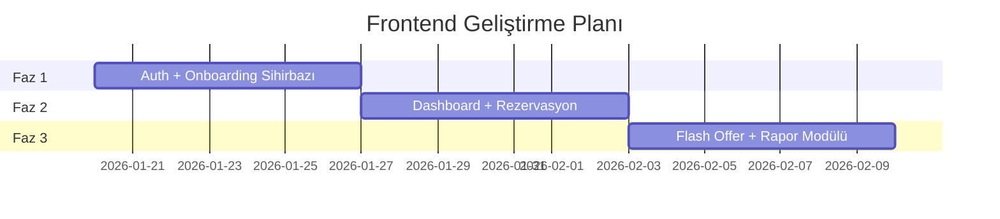

# 🚀 TravelSync: Stratejik Dönüşüm ve Uygulama Raporu

**Son Güncelleme:** 15 Ocak 2026  
**Hedef Pazar:** Almanya - Bağımsız oteller (10-100 oda) ve yerel acenteler  
**MVP Süresi:** 8 Hafta

---

## 📋 İçindekiler

1. [Stratejik Değişiklikler](#1-stratejik-değişiklikler)
2. [Kritik Eklentiler](#2-kritik-eklentiler)
3. [Backend Yol Haritası](#3-backend-yol-haritası)
4. [Frontend Yol Haritası](#4-frontend-yol-haritası)
5. [Zaman Çizelgesi](#5-zaman-çizelgesi)

---

## 1. Stratejik Değişiklikler

### 🛑 Durdurulması Gerekenler

| Mevcut Yaklaşım | Neden Durdurulmalı |
|-----------------|-------------------|
| B2C/Traveler Modülü (Phase 3) | Devlerle (Expedia, Booking) yarışmak anlamsız - **tamamen rafa kaldırılmalı** |
| Genel API yapıları | Almanya'ya özgü **Protel/SIHOT** ve **GoBD** standartlarına geçilmeli |
| Karmaşık AI vaatleri | "Machine Learning" yerine **"Otomatik Öneri"** gibi güven veren kavramlar |

### ✅ Başlanması Gerekenler

| Yeni Odak | Detay |
|-----------|-------|
| **Niş Hedef** | Almanya'daki 10-100 odalı bağımsız oteller, 1-5 çalışanlı yerel acenteler |
| **Temel Değer** | "Entegrasyon Derdi Yok, Ceza Korkusu Yok" |
| **Motto** | Komplikasyon yok, sadece çözüm |

---

## 2. Kritik Eklentiler

Pazardaki boşluğu dolduracak **4 ana eklenti**:

### A. 🔌 Tek Tıkla Bağlan (PMS Connector)

| Özellik | Detay |
|---------|-------|
| **Sorun** | Küçük otellerin %68'i Protel/SIHOT kullanıyor, entegrasyonlar pahalı |
| **Çözüm** | Backend'e "Connector Service" - otel sahibi sadece kullanıcı adı girer |
| **Etki** | Onboarding süresi haftalardan **dakikalara** iner |

### B. 📋 GoBD Uyumlu Rapor Butonu (Yasal Kalkan)

| Özellik | Detay |
|---------|-------|
| **Sorun** | Almanya'da vergi denetimi küçük işletmelerin kabusu (**€20K+ ceza riski**) |
| **Çözüm** | AuditLog verilerinden değiştirilemez PDF raporu |
| **Etki** | "Bizi kullanırsanız vergi dairesiyle sorununuz olmaz" mesajı |

### C. ⚡ Flash Offer (Fırsat) Motoru

| Özellik | Detay |
|---------|-------|
| **Sorun** | Son dakika boş odalar ve personel eksikliği |
| **Çözüm** | Tek tuşla "%40 indirim" → WhatsApp/Email ile acentelere bildirim |
| **Etki** | Gelir artışı, manuel telefon trafiği sonu |

### D. 🔒 Güvenli Ödeme Köprüsü (Escrow Lite)

| Özellik | Detay |
|---------|-------|
| **Sorun** | FTI iflası sonrası acente-otel arasında güven krizi |
| **Çözüm** | Stripe Connect ile misafir girişine kadar ödeme havuzda |
| **Etki** | Güven yeniden inşa edilir |

---

## 3. Backend Yol Haritası

Backend büyük oranda hazır (%85), ancak **Production-Ready** ve **Almanya Uyumlu** hale gelmeli.

### Adım 1: Güvenlik ve Altyapı (1. Hafta) 🔴 ACİL

```javascript
// server/server.js - Eklenecek middleware'ler
const rateLimit = require('express-rate-limit');
const mongoSanitize = require('express-mongo-sanitize');
const xss = require('xss-clean');

// Rate Limiting
const limiter = rateLimit({
  windowMs: 15 * 60 * 1000, // 15 dakika
  max: 100, // IP başına 100 istek
  message: 'Çok fazla istek, lütfen bekleyin'
});
app.use('/api', limiter);

// Sanitization
app.use(mongoSanitize());
app.use(xss());
```

| Görev | Dosya | Açıklama |
|-------|-------|----------|
| Rate Limiting | `server.js` | express-rate-limit + Redis |
| Input Sanitization | `server.js` | express-mongo-sanitize + xss-clean |
| Refactoring | `reservation.js` | İş mantığı → service'e taşınmalı |
| API Docs | Yeni | swagger-ui-express ile dökümantasyon |

### Adım 2: Yeni Servislerin İnşası (2-3. Hafta)

| Servis | Dosya Yolu | Kütüphane | Amaç |
|--------|------------|-----------|------|
| **PDF Service** | `services/pdf.service.js` | pdfmake / jsPDF | GoBD uyumlu rapor üretimi |
| **WhatsApp Service** | `services/whatsapp.service.js` | Twilio | Flash Offer bildirimleri |
| **PMS Adapter** | `services/pms/adapter.js` | - | Protel/SIHOT connector |

### Adım 3: Model Güncellemeleri

```javascript
// models/Property.js - Eklenecek alanlar
pms_settings: {
  provider: { type: String, enum: ['protel', 'sihot', 'manual'] },
  api_key: String,
  endpoint: String,
  last_sync: Date
},
tax_id: { type: String }, // Vergi numarası

// models/Agency.js - Eklenecek alan
whatsapp_notification_enabled: { type: Boolean, default: false }
```

### Adım 4: Analytics Controller (4. Hafta)

```javascript
// controllers/analytics.controller.js - Doldurulacak
const getOccupancyReport = async (req, res) => {
  const report = await Reservation.aggregate([
    { $match: { property_id: req.params.propertyId } },
    { $group: {
        _id: { $dateToString: { format: "%Y-%m-%d", date: "$check_in_date" } },
        occupancy: { $sum: 1 }
    }},
    { $sort: { _id: 1 } }
  ]);
  res.json({ success: true, data: report });
};
```

---

## 4. Frontend Yol Haritası

Frontend şu an **%0** - "Mobile-First" ve "Minimalist" yaklaşımla başlanmalı.

### Teknoloji Yığını

| Teknoloji | Amaç |
|-----------|------|
| **React + Vite** | Hızlı geliştirme |
| **TypeScript** | Tip güvenliği |
| **Tailwind CSS + Shadcn/UI** | Modern, temiz UI |
| **TanStack Query** | Veri çekme & cache |
| **Zustand** | Basit state yönetimi |

### UI/UX Tasarım İlkeleri

> [!IMPORTANT]
> Karmaşık dashboard'lar yerine **"Action Center"** yaklaşımı kullanılmalı!

| İlke | Uygulama |
|------|----------|
| **Dashboard Yok** | 3 büyük buton: "Bugünün Rezervasyonları", "Flash Offer", "Rapor Al" |
| **Sihirbaz Kurulum** | Hangi PMS? → Protel → Kullanıcı adı gir → Bitti |
| **Mobile First** | Acenteler ve müdürler ayakta çalışıyor |

### Geliştirme Sırası



| Hafta | Modül | Detay |
|-------|-------|-------|
| 1 | Auth | Login/Register + Kurulum Sihirbazı (4 adım) |
| 2 | Dashboard | "Bugün Ne Oluyor?" kartları + Rezervasyon listesi |
| 3 | Flash Offer | WhatsApp tetikleyici + onay modalı |
| 4 | Raporlama | GoBD PDF indirme ekranı |

### Onboarding Sihirbazı Adımları

```
┌─────────────────────────────────────────────────────────────┐
│  Adım 1/4: Otel Bilgileri                                   │
│  ┌─────────────────────────────────────────────────────┐   │
│  │ Otel Adı: [_________________________]               │   │
│  │ Adres:    [_________________________]               │   │
│  │ Oda Sayısı: [___]                                   │   │
│  └─────────────────────────────────────────────────────┘   │
│                                           [İleri →]         │
└─────────────────────────────────────────────────────────────┘

┌─────────────────────────────────────────────────────────────┐
│  Adım 2/4: PMS Seçimi                                       │
│  ┌───────────┐  ┌───────────┐  ┌───────────┐               │
│  │  Protel   │  │  SIHOT    │  │  Manuel   │               │
│  │    ✓      │  │           │  │           │               │
│  └───────────┘  └───────────┘  └───────────┘               │
│                                           [İleri →]         │
└─────────────────────────────────────────────────────────────┘

┌─────────────────────────────────────────────────────────────┐
│  Adım 3/4: Oda Tipleri                                      │
│  + Standart Oda (20 adet)                                   │
│  + Deluxe Oda (10 adet)                                     │
│  [+ Yeni Oda Tipi Ekle]                                     │
│                                           [İleri →]         │
└─────────────────────────────────────────────────────────────┘

┌─────────────────────────────────────────────────────────────┐
│  Adım 4/4: İlk Acentanızı Davet Edin                        │
│  E-posta: [_________________________]                       │
│  [Davet Gönder]        [Şimdilik Atla]                      │
│                                           [Tamamla ✓]       │
└─────────────────────────────────────────────────────────────┘
```

---

## 5. Zaman Çizelgesi

### 8 Haftalık MVP Planı

| Hafta | Alan | Görev | Hedef |
|-------|------|-------|-------|
| **1** | Backend | Güvenlik (Rate Limit, Sanitization) + Refactoring | Saldırılara kapalı, temiz kod |
| **2** | Backend | GoBD PDF Servisi + WhatsApp API Altyapısı | Yasal uyum + pazarlama altyapısı |
| **3** | Frontend | Proje kurulumu + Login + Onboarding Sihirbazı | Kullanıcıyı karşılayan ilk yüz |
| **4** | Frontend | Dashboard + "Bugün" Kartları | Otelcinin günlük özeti |
| **5** | Full Stack | PMS Entegrasyonu (Mock) + Veri Bağlantısı | Sistemin "bağlanabilir" olduğunu kanıtlama |
| **6** | Frontend | Rezervasyon Takvimi + Flash Offer Arayüzü | Temel operasyonların arayüzü |
| **7** | Test | E2E Testler (Cypress) + Yük Testi | Hata ayıklama ve stabilite |
| **8** | Pilot | 5 Butik Otel ile "Sessiz Lansman" | Gerçek veri ile doğrulama |

### İlerleme Özeti

```
Backend:     ████████████████░░░░ 85% → %100 hedefi (2 hafta)
Frontend:    ░░░░░░░░░░░░░░░░░░░░  0% → %80 hedefi (4 hafta)
Entegrasyon: ░░░░░░░░░░░░░░░░░░░░  0% → %50 hedefi (3 hafta)
Test:        ░░░░░░░░░░░░░░░░░░░░  0% → %70 hedefi (1 hafta)
```

---

## 🎯 Sonuç ve Aksiyon Özeti

> [!CAUTION]
> Karmaşık özellikler (tam AI, B2C modülleri) MVP sonrasına bırakılmalı. Önce **"Çalışıyor, Güvenli ve Basit"** mesajı verilmelidir.

### Kritik Başarı Faktörleri

1. **GoBD Uyumu** - Yasal güvenlik = Güven
2. **PMS Entegrasyonu** - Kolay kurulum = Düşük sürtünme
3. **Mobile-First UI** - Gerçek kullanım senaryolarına uyum
4. **Flash Offer** - Hemen değer görme

### Öncelik Matrisi

| Öncelik | Alan | Görev |
|---------|------|-------|
| 🔴 P0 | Backend | Güvenlik middleware'leri |
| 🔴 P0 | Backend | Reservation controller refactoring |
| 🟠 P1 | Backend | PDF + WhatsApp servisleri |
| 🟠 P1 | Frontend | Auth + Onboarding |
| 🟡 P2 | Frontend | Dashboard + Flash Offer |
| 🟢 P3 | Full Stack | PMS Connector |

---

**Hazırlayan:** TravelSync Development Team  
**Sonraki Review:** MVP tamamlandığında
